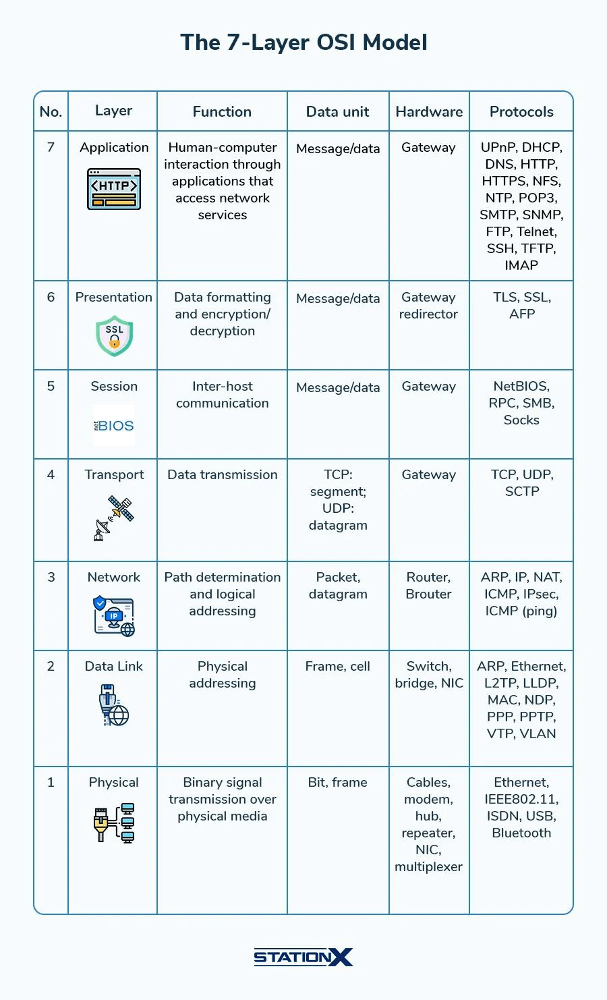

# OSI Model

Application Layer, Layer 7: DNS, FTP, FTPS, HTTP, HTTPS,IMAP, MQTT Protocol, SSH (Secure Shell), SFTP (SSH File Transfer Protocol is a secure file transfer protocol. It runs over the SSH protocol.), SSL, WebDAV

# TCP/IP

Historically, OSI model was built and published when the ISO was pushing for adoption of its own network protocols. They lost. The World, as a whole, preferred to use the much more simple TCP/IP.

网卡（Network Interface Card，简称 NIC） 是计算机中用于连接网络的硬件设备，它负责在计算机和网络之间发送和接收数据包。

1. 它可以是物理设备（如插在主板上的网卡芯片），
2. 也可以是虚拟设备（如虚拟机中的虚拟网卡）。
网卡是 OSI 模型中的 物理层（Layer 1）和数据链路层（Layer 2） 的实现设备。

| 类型	| 说明 |
| ---  | --- |
| 以太网网卡（Ethernet NIC）	| 使用网线连接，如 RJ-45 接口，传输速率有 100Mbps、1Gbps、10Gbps、100Gbps 等 |
| 无线网卡（WLAN NIC）|	使用 WiFi 协议（如 IEEE 802.11a/b/g/n/ac/ax）连接网络 |
| 虚拟网卡（Virtual NIC）	 | 用于虚拟机、容器等虚拟环境，如 VMware、VirtualBox、Docker 的虚拟网卡 |
| Loopback 网卡（lo）	| 本地回环网卡，用于测试本机网络协议栈，IP 通常是 127.0.0.1 |
| USB 网卡 / 蓝牙网卡 / 4G/5G 网卡	| 插入式外接网卡，支持不同通信方式
 |
# Raw Data
A .PCAP (Packet Capture) file is a data file used to store network traffic (wired or wireless network dat) captured during packet sniffing.

# Packer sniffer tools
The most popular packet capture tool is Wireshark. 他是一个开源的、跨平台的网络协议分析工具，可以实时捕获网络流量，并对数据包进行逐层解析（从物理层到应用层）。   

# PCAP Analysis

## Capture Packets捕获数据包
指在网络通信过程中，将经过网卡的数据包复制一份，进行存储或实时分析。
1. 选择你要监听的网卡（如以太网、WLAN）
2. 点击 “Start” 开始捕获
3. 停止后，你可以看到所有经过该网卡的数据包

## Inspecting Packets

## Filtering Packets